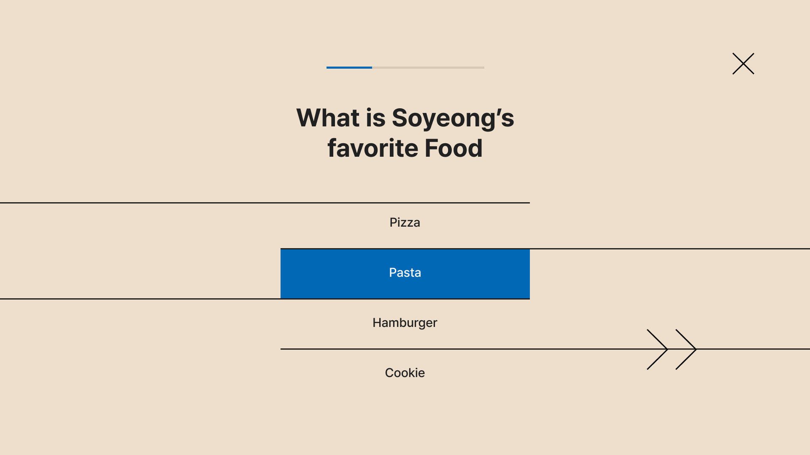
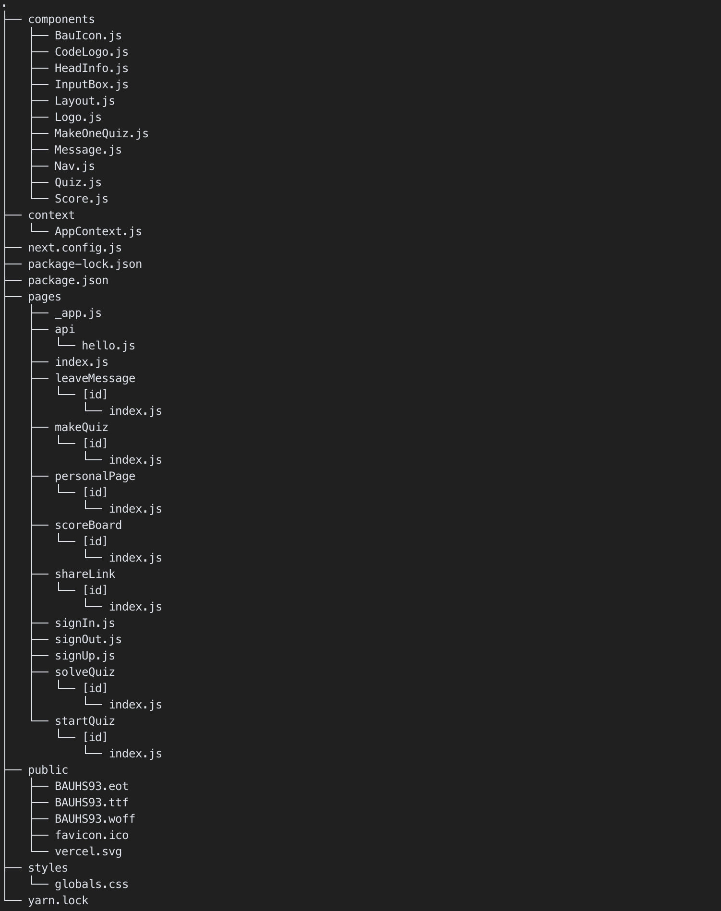

# Personal Quiz 🙂
- Team Number: 1
- Git Repository: [GitHub Link](https://github.com/yumin-jung/ID311-Final-Project)
- Live Demo: [YouTube Link](https://www.youtube.com/)

## Contents
- [Personal Quiz 🙂](#personal-quiz-)
  - [Contents](#contents)
- [Description of the Application 📚](#description-of-the-application-)
  - [Flow Chart](#flow-chart)
  - [User Interfaces](#user-interfaces)
- [Organization of Code 💻](#organization-of-code-)
  - [Overall Structure](#overall-structure)
  - [Directory Structure](#directory-structure)
    - [Client Directory](#client-directory)
    - [Server Directory](#server-directory)
  - [Design Patterns](#design-patterns)
    - [Atomic Design Pattern](#atomic-design-pattern)
    - [Observer Design Pattern](#observer-design-pattern)
    - [Provider Design Pattern](#provider-design-pattern)
    - [Routing Design Pattern](#routing-design-pattern)
  - [Main Functions](#main-functions)
    - [Functions in Client](#functions-in-client)
      - [pages/_app.js](#pages_appjs)
      - [context/AppContext.js](#contextappcontextjs)
      - [components directory](#components-directory)
      - [pages directory](#pages-directory)
    - [Functions in Server](#functions-in-server)
      - [index.js](#indexjs)
      - [routes/{path}.js](#routespathjs)
      - [model/{schema}.model.js](#modelschemamodeljs)
- [Challenges](#challenges)
  - [The first time to coding cooperation](#the-first-time-to-coding-cooperation)
  - [The first time to use new frameworks/libraries](#the-first-time-to-use-new-frameworkslibraries)
  - [Implementation UI as we want](#implementation-ui-as-we-want)
- [What We Learned 🧑‍💻](#what-we-learned-)
  - [About Frameworks / Libraries](#about-frameworks--libraries)
  - [About Cooperation](#about-cooperation)
- [Issue and Known Bug 🐞](#issue-and-known-bug-)
- [References 🌿](#references-)
    - [Work in Collaboration](#work-in-collaboration)
    - [React](#react)
    - [Next.js](#nextjs)
    - [Material UI](#material-ui)
    - [Node.js](#nodejs)
    - [Axios](#axios)
    - [Heroku](#heroku)
    - [UI design & CSS](#ui-design--css)

# Description of the Application 📚

## Flow Chart
This is flow chart of our application.


## User Interfaces
<!-- How It Works & What the User Has to Do -->
- ### Home Page
  

  - Input the maker's quiz code.
  - When writing the quiz code, the button for next page appears.


  
- ### SignUp/In Page
  
  

  - Putting first name, last name, username, and password, users can sign up our website.
  - By matching the username and password, users can access their personal page.


  
- ### Personal Page
  
  
  
  

  - If there is no quiz made before, there is a 'make quiz' button in the personal page.
  - By clicking the button, the maker will make his/her own quiz.
  - After making a quiz, personal unique patterns are generated.
  - If friends solve quizzes, the patterns start to be completed.
  - They can filter the results according to the colors.

- ### MakeQuiz Page
  

  - Makers can modify options and question contents.
  - They can add question, add options or delete options.


- ### ShareLink Page
  

  - By clicking 'share quiz' button, users can copy the texts with quiz link in clipboard.


- ### StartQuiz Page
  

  - Solvers can set their own nickname before starting the quiz.
  - The nickname cannot be overlapped with each other.

- ### SolveQuiz Page
  
    

  - On the top, there is a progress bar to show how many questions remain.
  - There are at least 2 options, and maximum is 4 options.
  - By left arrow button, they can go back to the previous question.

- ### LeaveResult Page
  
  

  - Solvers can view the remaining patterns they can fill up and their scores.
  - They will choose one of colors and one postion they want to leave their results, and they can leave a small message with their name and score.


# Organization of Code 💻
## Overall Structure


## Directory Structure
This is **Directory Structure** of our application

### Client Directory


- **Reusable components** are stored in the `component` directory.
- **Global store component** is stored in the `context` directory.
- **Pages of the application** are stored horizontally in the `pages` directory.

### Server Directory


- **Schema of the model** is stored in the `models` directory.
- **Paths that request data from DB** are stored in the `routes` directory.

## Design Patterns
<!-- If you used patterns, what did you use them for, and how do different parts of your code speak to each other? -->
### Atomic Design Pattern


- Divide the components and pages by `Atomic Design Pattern`.
- Why did we use Atomic Design Pattern?
  - Increase `reusability` of components.
  - Increase `scalability` of pages and components.

### Observer Design Pattern
- Pages communicate with components by `props`.
  
  ```js
  return (
    <ThemeProvider theme={theme}>
      <Nav isUser={isUser} quizCode={quizCode} />
    ...
  )
  ```

- Why did we use Observer Design Pattern?
  - Increase `reusability` because components receive data only through props.
  - Components and pages can be managed `independently`.
  - Make pages and components `speak to each other`.


### Provider Design Pattern
- Share data across the tree descendant nodes with Context API
  
  ```js
  function App({ Component, pageProps }) {
  const [isUser, setIsUser] = useState(false)
  const [quizCode, setQuizCode] = useState(null);
  const [quizNickname, setQuizNickname] = useState(null);
  const [score, setScore] = useState(0);

  return (
    <AppContext.Provider
      value={{
        isUser,
        setIsUser,
        quizCode,
        setQuizCode,
        quizNickname,
        setQuizNickname,
        score,
        setScore
      }}
    >
      <CssBaseline />
      <Layout>
        <Component {...pageProps} />
      </Layout>
    </AppContext.Provider>
  )}
  ```
- Why did we use Provider Design Pattern?
  - Every components and pages can `share the same state` of application.
  - Solving `prop drilling` in React.
  - Make pages `speak to each other`.

### Routing Design Pattern
- In server, request from client was divided into routes directory by `path`.
  
  ```js
  app.use('/api/users', require('./routes/users'));
  app.use('/api/quizzes', require('./routes/quizzes'));
  app.use('/api/scores', require('./routes/scores'));
  app.use('/api/messages', require('./routes/messages'));
  ```

- Why did we use Routing Design Pattern?
  - Increase `readability` and `ease of management` by Store code separately.
  - `Easy to debug` by tying them together with the same personality.

## Main Functions
<!-- What are the main functions/classes? -->
### Functions in Client
#### pages/_app.js
- `APP()`
  - Top component of every React components.
  - Wrap all pages with the global layout.
  - Especially, wrap all components with a global state using **Context API**.

#### context/AppContext.js
- `createContext(null)`
  - Creates a **global store** used in the application.

#### components directory
- Components like Nav are rendered differently depending on the **state of the page**.
- State of the page is transferred with **props**.

#### pages directory
- **Render** each page of the application.
- Pages created with [id] directory like scoreBoard provides **dynamic routing** using **queries**.

### Functions in Server
#### index.js
- `app.use('/api/{path}', require('./routes/{path}'))`
  - By using the router, the structure of the server has been **simplified and easily scalable**.
- `mongoose.connect()`
  - Connect Node.js server & MongoDB

#### routes/{path}.js
- `router.post()`
  - Post CRUD-related requests to MongoDB.

#### model/{schema}.model.js
- `mongoose.model("{Name}", {name}Schema)`
  - Specify the structure and conditions of the information to be stored in the DB.
# Challenges 
## The first time to coding cooperation
- Challenge) Our group have no or a few experience in programming to collaborate with others, so it was difficult to properly allocate tasks and communicate with each other.
  - There are so many works, such as planning, organizing functions, setting DB, UI design, and QA.
  - Due to lack of knowledge of programming, expressing what we want about codes in words was difficult.
  - Initially, we didn't decide the person handling the DB and divided the client pages that shared one DB among us. Thus, it was not clear how to implement each page for the data structure, so the work efficiency was not good.
- How to overcome) 
  - After doing team meeting about the DB structure, we divided our tasks with `maker-flow / solver-flow / DB / CSS(design)`
  - By establishing regular code review meetings, development rules(commit messages, branch, and PR), we tried to understand others' codes and improve communication quality.
  - For the tasks other than coding, we used collaboration tools like Figma, Miro, or Notion. Thus, we fully understood what each member said by visualizating screen or diagrams.

## The first time to use new frameworks/libraries
- Challenge) We tried to set up appropriate frameworks with our project, but there was only one member who made website with DB. One member had never done the web development. Thus, using various frameworks(React, Next.js, node.js, and MongoDB) was a challenge.
  - No one had used Next.js before, so dealing with dynamic routing and perfectly understanding SSR and SSG concept was difficult.
  - It took a long time to make all the logics without source code for the functions we wanted.
- How to overcome) We studied some frameworks together to be familiar with our frameworks.
  - We Shared the reference links or videos when we coded.
  - In the regular meeting, we planned code structure together and discuss how to implement each function and DB.
  - We tried to understand the philosophy and patterns of frameworks and libraries, so we made lots of efforts to build the codes based on them.

## Implementation UI as we want
- Challenges) UI design was later than almost functional implementation. It was hard to modify our codes neatly while maintaining look & feel of the desired UI.
  - We put the BAUHAUS styled patterns to the personal pages. Thus, some functions about choosing colors or orders of patterns are needed. 
  - There are some slightly different functions in each page, but overall look was similar.
- How to overcome) It is designed to match the React by making our UI consistent and reusable.


# What We Learned 🧑‍💻
## About Frameworks / Libraries
1. Each framework contains its characteristics and the philosophy of the developer who made it. Also, to make good use of the built-in funtions in each frameworks or libraries to implement what we want.
2. To facilitate high scalability and maintenance, we find it necessary to consider various utilization possiblities and choose appropriate frameworks and code structures.
3. In detail, we realized each framework's features.
   1. React
      - Designed to `separate` and `synthesize` components to maximize the reusability.
      - Write code `concisely` using React hooks.
   2. Next.js
      - Easy to develop separate pages and components.|
      - Easy to implement `dynamic routing`.
      - Easy to implement with `SSR` and `SSG` for `SEO`.
      - Provides functions related to `router` and `image`.|
   3. Material UI
      - `Easily implement UI` without writing css one by one.
      - MUI's sx option allows to insert the specific css.
   4. Mongo DB
      - Can store many different forms of data.
      - MongoDB has a good `scalability` and `flexibility`.
   5. Vercel & Heroku
      - `Easy to deploy` of client and server

## About Cooperation
1. We realized that efficient progress is possible after we define the overall frame and structures of client, server, and DB, then distribute tasks.
2. All the team members have other projects and exams, so sharing each progress with others was really important because each built functions in different places and time. It is critical not only to establish development rules and code review methods in advance, but also to make efforts to clearly communicate each work or situation with others.
3. All the members had a different picture of the project in their head, and the detailed functions and page flow were also different. Before distributing tasks, it is necessary to visualize them (flowchart or GUI) so that we can look in the same direction.
4. We often had disagreements. For the consensus, we tried to make the criteria based on the direction and characteristics of the website, not the individual's taste. Through this process, we can create a consistent web service.

# Issue and Known Bug 🐞
- We used dynamic routing by query. If users go back the pages or refresh the screen, the errors will occur

# References 🌿

### Work in Collaboration
- [What is Good Commit?](https://blog.ull.im/engineering/2019/03/10/logs-on-git.html)

### React
- React Hooks
  - [useContext Hook](https://ko.reactjs.org/docs/context.html)
  - [useEffect Hook](https://ko.reactjs.org/docs/hooks-effect.html)
  - [useState Hook](https://ko.reactjs.org/docs/hooks-state.html)
- State Management
  - [Context API vs Redux vs React Query](https://mingule.tistory.com/74)

### Next.js
- Documentation
  - [Next.js Documentation](https://nextjs.org/docs/getting-started)
- Features of Next.js
  - [44Bits YouTube](https://www.youtube.com/watch?v=jg2ha2RIWN0&ab_channel=44BITS)
  - [코딩앙마 YouTube](https://www.youtube.com/watch?v=Ujjdn2wMIew&list=PLZKTXPmaJk8Lx3TqPlcEAzTL8zcpBz7NP&ab_channel=%EC%BD%94%EB%94%A9%EC%95%99%EB%A7%88)
  - [데브리 YouTube](https://www.youtube.com/watch?v=pdWQvfQBSGg&ab_channel=%EB%8D%B0%EB%B8%8C%EB%A6%AC)
- CSR, SSR, and SSG
  - [NAVER - What is SSR](https://d2.naver.com/helloworld/7804182)
  - [SSR & SSG](https://velog.io/@longroadhome/FE-SSRServer-Side-Rendering-%EA%B7%B8%EB%A6%AC%EA%B3%A0-SSGStatic-Site-Generation-feat.-NEXT%EB%A5%BC-%EC%A4%91%EC%8B%AC%EC%9C%BC%EB%A1%9C)
- Resolving Error 
  - [React Hydration Error](https://nextjs.org/docs/messages/react-hydration-error)

### Material UI
- [MUI Documentation](https://mui.com/material-ui/getting-started/overview/)

### Node.js
- Connect Node.js Server and MongoDB
  - [John Ahn YouTube](https://www.youtube.com/watch?v=fM0Vj7dBcm8&list=PL9a7QRYt5fqnlSRu--re7N_1Ean5jFsh3&index=4&ab_channel=JohnAhn)
  - [run_dev_aiden Tech Blog](https://velog.io/@run_dev_aiden/MongoDB-%EC%97%B0%EA%B2%B0%ED%95%98%EA%B8%B0)

### Axios
  - [Ajax vs Axios vs fetch](https://velog.io/@kysung95/%EA%B0%9C%EB%B0%9C%EC%83%81%EC%8B%9D-Ajax%EC%99%80-Axios-%EA%B7%B8%EB%A6%AC%EA%B3%A0-fetch)

### Heroku
  - [Deploy Node.js Server with Heroku](https://rkdvnfma90.tistory.com/224)

### UI design & CSS
  - [Bauhaus pattern generator](https://tool.graphics/bauhaus)
  - 
