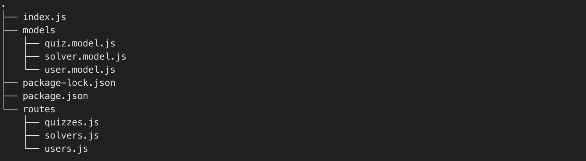

# Personal Quiz 🙂
- Team Number: 1
- Git Repository: [GitHub Link](https://github.com/yumin-jung/ID311-Final-Project)
- Live Demo: [YouTube Link](https://www.youtube.com/)

## Contents
- [Description of the Application 📚](#description-of-the-application-)
  - [Flow Chart](#flow-chart)
  - [User Interfaces](#user-interfaces)
- [Organization of Code 💻](#organization-of-code-)
  - [Directory Structure](#directory-structure)
  - [Design Patterns](#design-patterns)
  - [Main Functions](#main-functions)
- [What We Learned 🧑‍💻](#what-we-learned-)
  - [Novel Features](#novel-features)
  - [Libraries, Frameworks, and Tools](#libraries-frameworks-and-tools)
- [Issue and Known Bug 🐞](#issue-and-known-bug-)
- [References 🌿](#references-)

# Description of the Application 📚

## Flow Chart
This is flow chart of our application.

## User Interfaces
<!-- How It Works & What the User Has to Do -->
- ### Home Page
  

  - 1
  - 2

- ### SignIn Page
  

  - 1
  - 2

- ### SignUp Page
  

  - 1
  - 2

- ### SignOut Page

  - 1
  - 2
  
- ### Personal Page
  

  - 1
  - 2

- ### MakeQuiz Page
- 

  - 1
  - 2

- ### ShareLink Page
  

  - 1
  - 2

- ### StartQuiz Page
  

  - 1
  - 2

- ### SolveQuiz Page
  

  - 1
  - 2

- ### LeaveMessage Page
  

  - 1
  - 2

- ### ScoreBoard Page
  

  - 1
  - 2

# Organization of Code 💻

## Directory Structure
This is **Directory Structure** of our application

### Client Directory

- **Reusable components** are stored in the `component` directory.
- **Global store component** is stored in the `context` directory.
- **Pages of the application** are stored horizontally in the `pages` directory.

### Server Directory

- **Schema of the model** is stored in the `models` directory.
- **Paths that request data from DB** are stored in the `routes` directory.

## Design Patterns
<!-- If you used patterns, what did you use them for, and how do different parts of your code speak to each other? -->
### Atomic Design Pattern
- client - components & pages 

### Observer Design Pattern
- react - props

### Provider Design Pattern
- Context API
  
### Routing Design Pattern
- Client - Next.js Dynamic Routing
- Server

### Module

## Main Functions
<!-- What are the main functions/classes? -->
### Functions in Client
#### Functions in pages/_app.js
- `APP()`
  - Top component of every React components.
  - Wrap all pages with the global layout.
  - Especially, wrap all components with a global state using **Context API**.

#### Functions in context/AppContext.js
- `createContext(null)`
  - Creates a **global store** used in the application.

#### Functions in components directory
- Components like Nav are rendered differently depending on the **state of the page**.
- State of the page is transferred with **props**.

#### Functions in pages directory
- **Render** each page of the application.
- Pages created with [id] directory like scoreBoard provides **dynamic routing** using **queries**.

### Functions in Server
#### Functions in index.js
- `app.use('/api/{path}', require('./routes/{path}'))`
  - By using the router, the structure of the server has been **simplified and easily scalable**.
- `mongoose.connect()`
  - Connect Node.js server & MongoDB

#### Functions in routes/{path}.js
- `router.post()`
  - Post CRUD-related requests to MongoDB.

#### Functions in model/{schema}.model.js
- `mongoose.model("{Name}", {name}Schema)`
  - Specify the structure and conditions of the information to be stored in the DB.

# What We Learned 🧑‍💻
## Novel Features

## Libraries, Frameworks, and Tools

### React
### Next.js
### Material UI

### MongoDB

### Vercel
### Heroku

### Axios

# Issue and Known Bug 🐞

# References 🌿

### Work in Collaboration
- [What is Good Commit?](https://blog.ull.im/engineering/2019/03/10/logs-on-git.html)

### React
- #### React Hooks
  - [useContext Hook](https://ko.reactjs.org/docs/context.html)
  - [useEffect Hook](https://ko.reactjs.org/docs/hooks-effect.html)
  - [useState Hook](https://ko.reactjs.org/docs/hooks-state.html)
- #### State Management
  - [Context API vs Redux vs React Query](https://mingule.tistory.com/74)
### Next.js
- [Next.js Documentation](https://nextjs.org/docs/getting-started)
- #### Features of Next.js
  - [44Bits YouTube](https://www.youtube.com/watch?v=jg2ha2RIWN0&ab_channel=44BITS)
  - [코딩앙마 YouTube](https://www.youtube.com/watch?v=Ujjdn2wMIew&list=PLZKTXPmaJk8Lx3TqPlcEAzTL8zcpBz7NP&ab_channel=%EC%BD%94%EB%94%A9%EC%95%99%EB%A7%88)
  - [데브리 YouTube](https://www.youtube.com/watch?v=pdWQvfQBSGg&ab_channel=%EB%8D%B0%EB%B8%8C%EB%A6%AC)
- #### CSR, SSR, and SSG
  - [NAVER - What is SSR](https://d2.naver.com/helloworld/7804182)
  - [SSR & SSG](https://velog.io/@longroadhome/FE-SSRServer-Side-Rendering-%EA%B7%B8%EB%A6%AC%EA%B3%A0-SSGStatic-Site-Generation-feat.-NEXT%EB%A5%BC-%EC%A4%91%EC%8B%AC%EC%9C%BC%EB%A1%9C)
- #### Resolving Error 
  - [React Hydration Error](https://nextjs.org/docs/messages/react-hydration-error)

### Material UI
- [MUI Documentation](https://mui.com/material-ui/getting-started/overview/)

### Node.js
- #### Connect Node.js Server and MongoDB
  - [John Ahn YouTube](https://www.youtube.com/watch?v=fM0Vj7dBcm8&list=PL9a7QRYt5fqnlSRu--re7N_1Ean5jFsh3&index=4&ab_channel=JohnAhn)
  - [run_dev_aiden Tech Blog](https://velog.io/@run_dev_aiden/MongoDB-%EC%97%B0%EA%B2%B0%ED%95%98%EA%B8%B0)

### Deploy
- #### Heroku
  - [Deploy Node.js Server with Heroku](https://rkdvnfma90.tistory.com/224)
